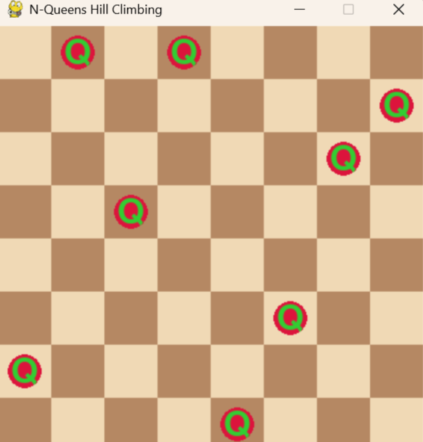

# N-Queens Problem Using Hill-Climbing Algorithm

This project solves the **N-Queens Problem** using the **Hill-Climbing Algorithm** and visualizes the solution using **Pygame**.

## Problem Description

The N-Queens problem requires placing **N queens** on an `N × N` chessboard such that:

* No two queens share the same row
* No two queens share the same column
* No two queens share the same diagonal

This implementation uses:

* `N = 8`
* Hill-Climbing local search
* Pygame visualization

## Hill-Climbing Algorithm

The algorithm:

1. Generates a random board state
2. Calculates the heuristic value
3. Generates neighboring states
4. Selects the neighbor with fewer conflicts
5. Repeats until:

   * a solution is found, or
   * a local optimum is reached

The heuristic function counts attacking queen pairs.

Goal state:

h(n)=0

## Example Output

```text
Initial State: [6, 1, 4, 0, 7, 5, 2, 1]
Initial Heuristic: 4
Final State: [6, 0, 3, 0, 7, 5, 2, 1]
Final Heuristic: 2
```

